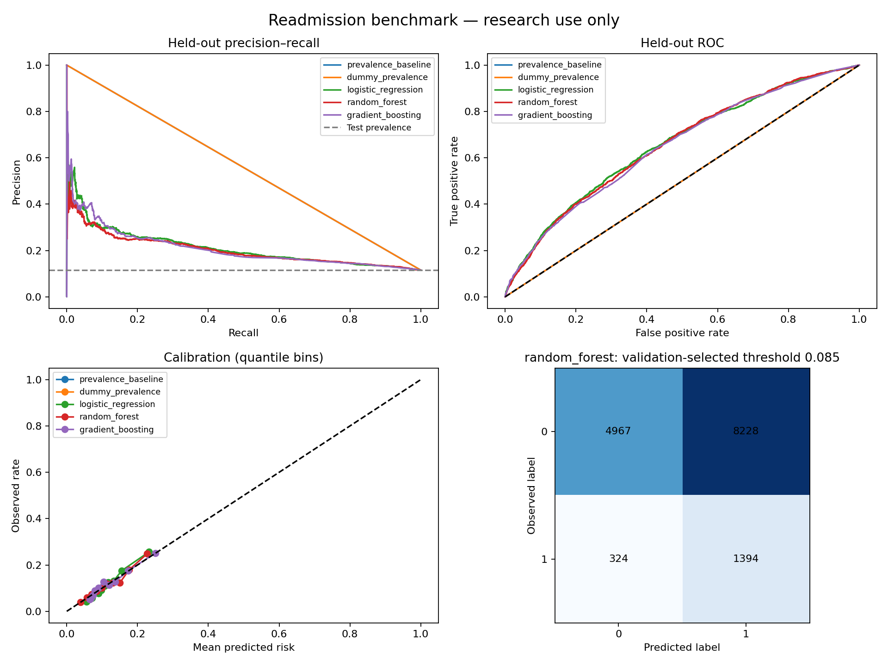

# Patient Readmission Risk Prediction

A leakage-aware machine-learning benchmark for estimating recorded 30-day readmission from discharge-available fields in the UCI Diabetes 130-US Hospitals dataset.

> **Academic portfolio study only.** This is not a clinical tool and must not be used for treatment, triage, discharge, deployment, or any decision affecting an individual.

## Model Performance Preview



## Held-out Results

| KPI | Result |
| --- | ---: |
| Eligible Discharge Encounters | 99,343 |
| Held-out Test Encounters | 14,913 |
| Selected Model | Random Forest |
| Average Precision | 0.2023 |
| ROC-AUC | 0.6545 |
| Calibrated Brier Score | 0.0985 |
| Recall at Exploratory Threshold | 81.14% |

Average precision is compared with a 0.1152 test-set prevalence baseline. These results describe a historical benchmark, not clinical utility or deployment performance.

## Questions Explored

- Can discharge-available encounter fields rank recorded 30-day readmission risk above the prevalence baseline?
- How do logistic regression, random forest, and gradient boosting compare on held-out data?
- How well calibrated are predicted probabilities?
- What precision and recall result from a validation-selected, recall-weighted threshold?
- Which inputs show the strongest validation permutation importance?
- How do descriptive subgroup metrics vary across sufficiently large groups?

## What I Built

- Patient-disjoint train, calibration, validation, and test partitions to reduce leakage.
- End-to-end scikit-learn pipelines that fit imputation, scaling, and encoding on training data only.
- Baseline and three candidate models, selected by validation average precision before test evaluation.
- Separate probability calibration, a validation-only F2 threshold demonstration, bootstrap intervals, SHAP, permutation importance, and descriptive subgroup audit.
- A responsive held-out model-performance dashboard and reproducibility artifacts.

## Technology Used

- Python: pandas, NumPy, scikit-learn, SHAP, matplotlib, joblib
- Machine learning: Logistic Regression, Random Forest, Gradient Boosting, calibration
- Evaluation: average precision, ROC-AUC, Brier score, precision, recall, F1/F2, confusion matrix
- Quality: patient-level split checks and preprocessing protocol tests

## Data and Modeling Protocol

Source: [UCI Diabetes 130-US Hospitals for Years 1999–2008](https://archive.ics.uci.edu/dataset/296/diabetes%2B130-us%2Bhospitals%2Bfor%2Byears%2B1999-2008), CC BY 4.0. The prediction point is discharge. Target `1` is the source label `<30`; target `0` combines `NO` and `>30`.

The model uses 21 discharge-available encounter fields. Encounter ID, patient ID, target, race, and gender are excluded from model features; race and gender are retained only for the descriptive subgroup audit. Expired/hospice dispositions are excluded because their endpoint differs from readmission.

## Project Structure

```text
patient-readmission-risk-prediction/
├── reports/          # Model card and data dictionary
├── screenshots/      # README evaluation preview
├── tests/            # Protocol and leakage checks
├── run.py            # Reproducible benchmark pipeline
└── requirements.txt
```

## Run Locally

```powershell
cd patient-readmission-risk-prediction
.\.venv-p2\Scripts\Activate.ps1
python -m pip install -r requirements.txt
python run.py --bootstrap 100
python -m pytest -q
```

Open `outputs/dashboard.html` for the interactive aggregate evaluation report. Generated outputs also include comparison tables, split manifest, subgroup audit, SHAP and permutation importance, model artifact, and run manifest.

## Research App and Engineering Practices

Launch the companion Streamlit app after generating the artifacts:

```powershell
streamlit run app.py
```

The app is intentionally aggregate-only: it presents held-out performance, model comparison, importance, and subgroup-audit artifacts, but does not accept patient inputs or return individual risk scores. This demonstrates an appropriate boundary between a portfolio research interface and clinical deployment.

The repository also includes GitHub Actions protocol tests. Together with the fixed seed, data checksum, split manifest, model artifact, and run manifest, these provide a reproducible audit trail for each benchmark run.

## Safety, Fairness, and Limits

This historical benchmark has neither temporal nor external validation; labels may miss readmissions outside the recorded system. Repeated encounters within a split remain correlated. Subgroup estimates are exploratory, omit small groups, and do not establish fairness. SHAP and permutation importance describe model reliance, not causation. See the [model card](reports/model_card.md) for intended use, risks, privacy, and monitoring limits.
